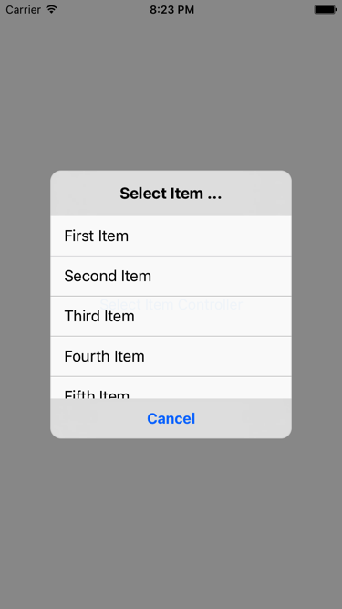

# SelectItemController

SelectItemController is a single selectable dialog. It's easy to use, written in Swift.




## Requirements
- Swift 3.0.2
- iOS 8.0 or later


## Installation

### Carthage

* Cartfile

```Cartfile
github "keygx/SelectItemController"
```
or

```Cartfile
github "keygx/SelectItemController" "branch-name"
```
or

```Cartfile
github "keygx/SelectItemController" "tag"
```

* install

```
$ carthage update
```
To integrate "SelectItemController.framework" into your Xcode project


## Usage
```swift
let list = ["First Item", "Second Item", "Third Item", "Fourth Item", "Fifth Item"]
let params = Parameters(title: "Select Item ...", items: list, cancelButton: "Cancel")
    
SelectItemController().show(parent: self, params: params) { (index) in
    if let index = index {
        print("selected: \(list[index])")
    } else {
        print("cancel")
    }
}
```


## License

SelectItemController is released under the MIT license. See LICENSE for details.


## Author

Yukihiko Kagiyama (keygx) <https://twitter.com/keygx>
