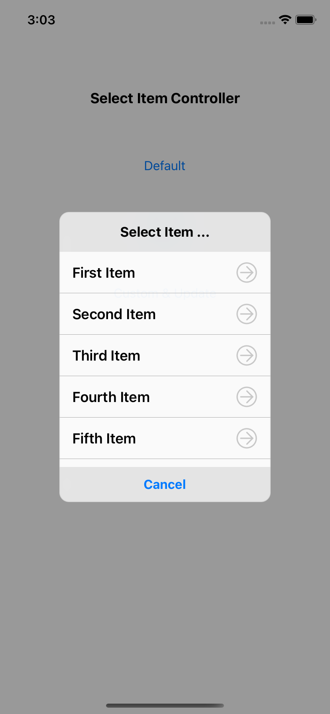
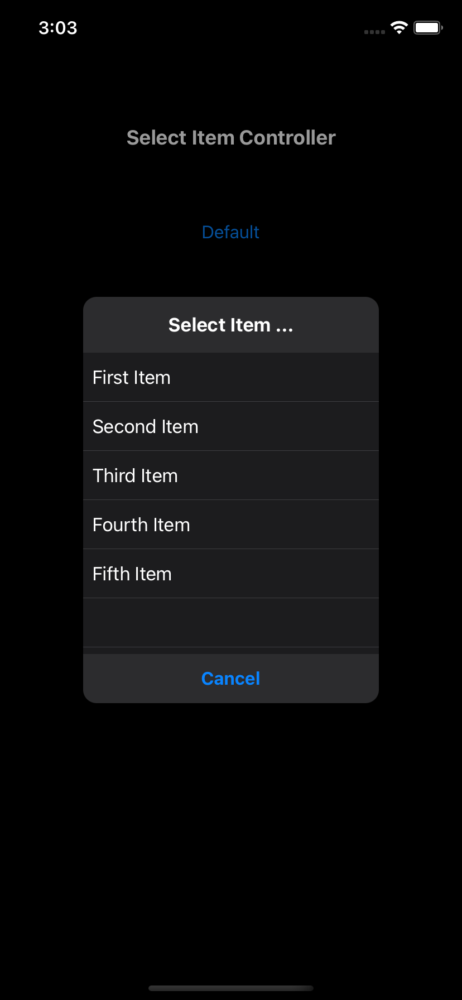
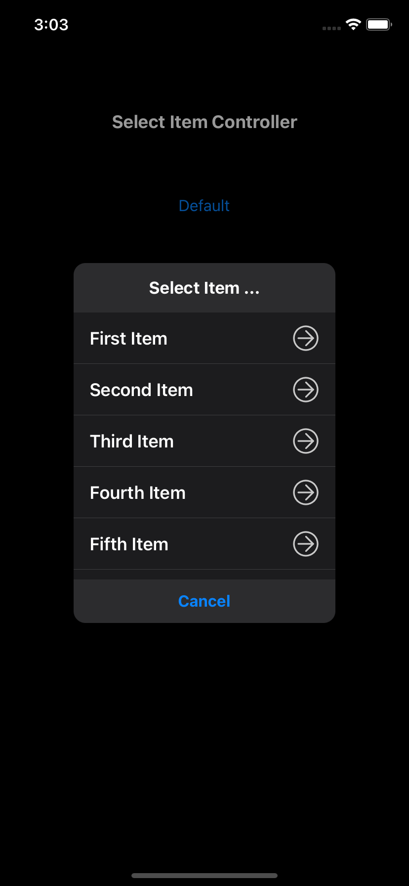

# SelectItemController

SelectItemController is a single selectable dialog. It's easy to use, written in Swift.

### Light Mode

| Default Cell | Custom Cell |
|:---:|:---:|
|  |  |

### Dark Mode

| Default Cell | Custom Cell |
|:---:|:---:|
|  |  |

## Requirements
- Swift 5.1
- iOS 8.0 or later


## Installation

### Carthage

```Cartfile
github "keygx/SelectItemController"
```

### Swift versions support

- Swift 5.1, tag "swift5.1"
- Swift 5, tag "swift5"
- Swift 4.2, tag "swift4.2"
- Swift 4.1, tag "swift4.1"
- Swift 4.0, tag "swift4.0"


## Usage
### Default
```swift
let items = ["First Item", "Second Item", "Third Item", "Fourth Item", "Fifth Item"]
let params = Parameters(title: "Select Item ...", items: items, cancelButton: "Cancel")
    
SelectItemController().show(parent: self, params: params) { (index) in
    if let index = index {
        print("selected: \(items[index])")
    } else {
        print("cancel")
    }
}
```

### Custom
```swift
let customTableView = CustomTableView() // User-created UITableView and custom cell
let params = Parameters(title: "Select Item ...", itemTableView: customTableView, cancelButton: "Cancel")
    
SelectItemController().show(parent: self, params: params) { (index) in
    if let index = index {
        print("selected: \(customTableView.items[index])")
    } else {
        print("cancel")
    }
}
```


## License

SelectItemController is released under the MIT license. See LICENSE for details.


## Author

Yukihiko Kagiyama (keygx) <https://twitter.com/keygx>
